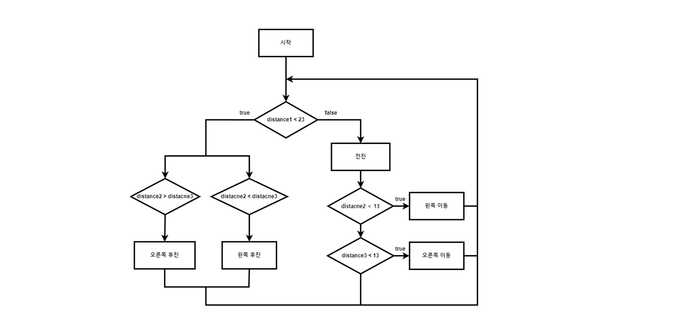

# Auto_drive_car
## 프로젝트 목적
초음파 센서와 DC motor를 통해 장애물을 피해 자율운행하는 자동차를 만듭니다.  
## 사용 디바이스
stm32f411, 초음파 센서, DC moter, 블루투스 모듈, 안드로이드 휴대폰
## 개발환경
STM32CubeIDE, arduino bluetooth application(휴대폰에 설치)
## High Level Design

## 시연영상

원본영상(이 링크의 raw file 다운로드시 좀 더 크고 명확한 영상을 확인하실 수 있습니다. ) :

[img_video/auto_drive.mp4](https://github.com/BrotherHwan/Auto_drive_car/blob/main/img_video/auto_drive.mp4)
